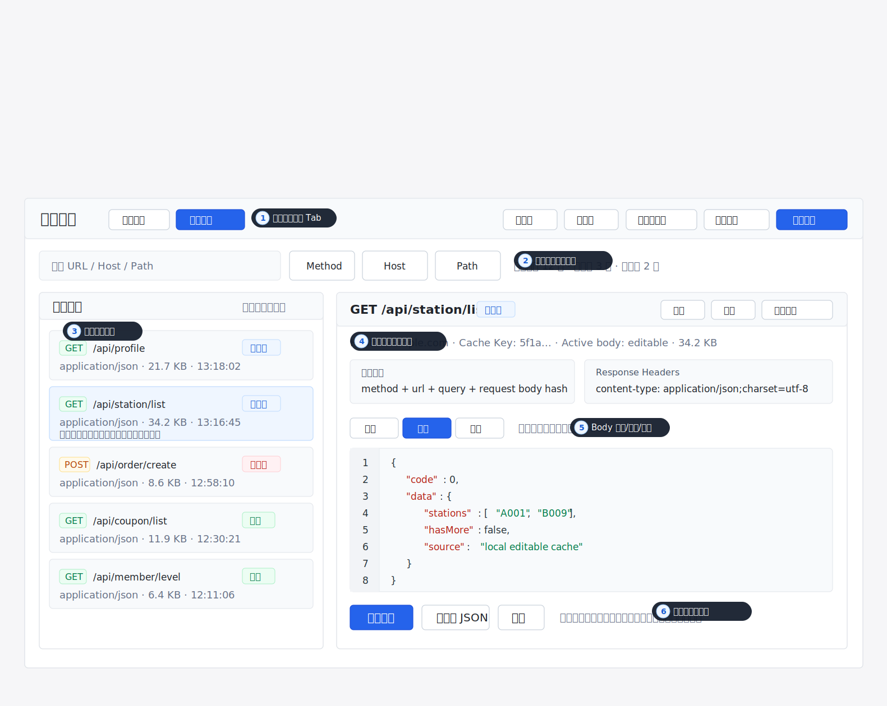
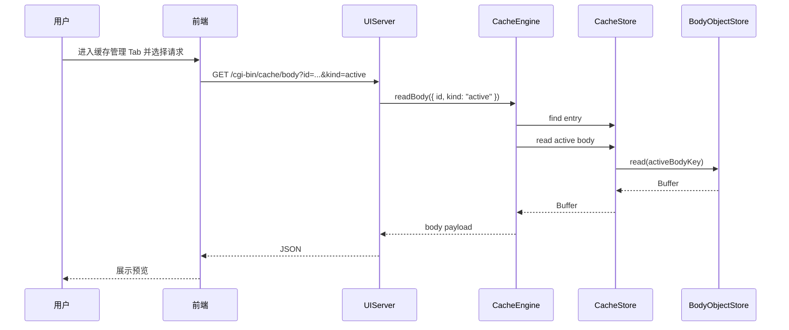
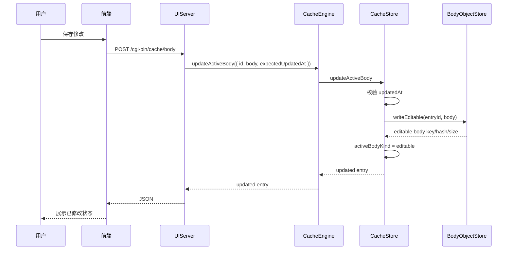

# 缓存响应数据修改功能方案

本文记录 `whistle.api-cache` 的缓存数据修改功能方案，范围包含产品方案、交互设计、UI 调整和技术方案。本方案只定义设计，不进入具体实现。

## 审计结论

本方案经过 2026-06-11 与当前代码核对后继续采用“缓存管理 Tab”方向，但需要把技术边界写得更精确：

- 当前代码已经具备 `active body` / `original body` 的存储语义、保存 editable body、恢复 original body、重新录制时保留 editable body、导入导出 active body 等基础能力。
- 当前代码已经有 `POST /cgi-bin/cache/body` 与 `POST /cgi-bin/cache/body/restore-original`，但还缺少读取 active/original body 的 UI API。
- 当前 `CacheStore.readBody(entry)` 只能读取 active body，缺少按 `active | original` 读取的明确边界。
- 当前 `sendJson` 捕获异常后统一返回 `500`，保存冲突、条目不存在、不可编辑响应体等状态需要结构化，否则前端无法做正确提示。
- 当前前端仍是单文件 `public/app.js`，本期应保持增量实现，不把缓存管理拆成构建型前端工程。

## 背景

当前插件已经支持录制、回放、导入、导出、删除、禁用、调整 TTL 和匹配测试。存储层也已经具备 `original body` 与 `active body` 的基础语义：

- `original body` 表示真实录制得到的原始响应内容。
- `active body` 表示当前回放实际使用的响应内容。
- 当用户修改缓存内容后，`active body` 可以指向 `editable body`。
- 重新录制命中同一条缓存时，如果该缓存已经使用 `editable body`，不应覆盖用户编辑结果。

现阶段缺口主要在产品化闭环：用户还不能在插件面板中查看、编辑、保存、恢复缓存响应内容，也缺少读取响应 body 的 UI API。

## 目标

- 允许用户查看单条缓存的当前回放响应数据。
- 允许用户修改缓存下来的接口响应 body，并让后续回放立即使用修改后的数据。
- 支持恢复到原始录制响应。
- 明确展示缓存是否已被修改，避免用户误以为仍在回放原始响应。
- 对 JSON 和文本响应提供友好的预览、格式化和保存体验。
- 保留现有缓存列表的高密度运维面板风格，不把本期扩展成完整 Mock 平台。

## 非目标

- 不做批量修改缓存内容。
- 不做字段级可视化 JSON Diff。
- 不做多版本历史。
- 不修改响应头。
- 不做自动生成 Mock 场景。
- 不支持二进制响应在线编辑。
- 不改变当前录制、回放、匹配、TTL 和安全策略。

## 方案选择

推荐一步到位采用独立“缓存管理”Tab。

当前 UI 是高密度工具面板：上方展示状态、规则、健康、诊断和匹配测试，下方以表格方式展示缓存列表。每行已有“详情、启用/禁用、TTL、同 Host、同 Path、删除”等操作，如果直接在行操作区增加多个编辑按钮，会让表格更拥挤。

响应数据编辑不是缓存列表的轻量补充，而是一类独立工作流：用户需要筛选请求、查看响应体、修改 JSON、保存、恢复原始，并且可能连续处理多条请求。这个过程需要稳定的请求选择区和固定编辑器，如果放在表格详情展开行中，编辑区会跟随列表滚动和展开状态变化，不利于连续编辑，也会让缓存列表承担过多职责。

因此本方案不采用“详情内联编辑”作为交付路径，而是直接新增“缓存管理”Tab：

- `缓存列表` 继续承担运维视图职责：查看缓存、展开详情、禁用、TTL、同 Host、同 Path、删除。
- `缓存管理` 承担编辑视图职责：筛选请求、查看 active/original body、编辑响应数据、保存、恢复原始。
- 两个 Tab 共享同一份缓存数据和状态标记，但交互目标不同。

备选方案：

- 缓存详情区内联编辑：改动看似更小，但不适合多请求连续编辑，也会让表格详情区变得过重。
- 独立弹窗或抽屉编辑器：编辑空间比详情区大，但仍然依附列表选择，连续切换请求时状态管理复杂。
- 独立页面：扩展性最好，但用户需要离开当前插件面板上下文，当前阶段没有必要。

结论：一步到位新增“缓存管理”Tab。缓存列表中只增加“已修改”状态和“在缓存管理中打开”的轻量入口，不在详情区实现完整编辑器。

## 缓存管理 Tab 交互策略

### 设计定位

缓存管理 Tab 面向“逐条编辑缓存响应”的工作流，而不是替代缓存列表的全部能力。用户仍然可以在缓存列表中完成运维动作；当需要修改响应 body 时，进入缓存管理 Tab，在一个稳定的分栏界面中完成编辑。

适用场景：

- 临时调整单个接口返回值。
- 排查某条缓存是否回放了修改后的 body。
- 修改后马上通过现有“测试匹配”或业务页面验证。
- 需要连续编辑多条请求。
- 需要一边筛选请求一边保持编辑器不关闭。
- 需要频繁在上一条、下一条请求之间切换。

推荐位置：

- 在当前页面主工作区增加页签：`缓存列表`、`缓存管理`。
- 默认仍进入 `缓存列表`，保持当前工具面板体验。
- 点击缓存列表中的“在缓存管理中打开”时，切到 `缓存管理` 并选中对应请求。

缓存管理模块结构：

- 左侧请求列表：保留搜索、Host、Path、方法、状态、已修改、已过期、启用状态等筛选。
- 右侧请求详情：展示基础信息、命中策略、Response Headers、Response Body 编辑器。
- 顶部工具条：提供上一条、下一条、仅看已修改、仅看可编辑、保存、恢复原始。
- 未保存保护：切换请求、刷新或离开模块时，如果存在未保存内容，需要提示保存或丢弃。

这种交互更适合缓存响应编辑，因为列表选择状态稳定，编辑器不会跟随表格展开/收起移动，用户可以在请求之间快速切换，并且响应体编辑区能获得更大的横向空间。

交互图如下，仍沿用当前插件的密度、颜色和面板风格，只把主工作区扩展出缓存管理分栏。图中的数字标注直接对应关键交互区域，避免读者脱离 UI 去阅读独立说明：



图中交互区域说明：

- 1. 主工作区页签：`缓存列表` 与 `缓存管理` 并列；默认进入缓存列表，从缓存列表点击“管理”时切换到缓存管理并选中对应请求。
- 2. 筛选与导航：搜索、Method、Host、Path、已修改、仅可编辑、上一条、下一条都只作用于当前缓存管理列表。
- 3. 左侧请求列表：承载请求选择、状态标记和连续切换；列表项展示 method、path、content-type、body 大小、更新时间、原始/已修改/已过期状态。
- 4. 右侧请求信息：展示当前请求的基础信息、命中策略和 Response Headers，用于确认当前编辑对象。
- 5. Response Body 编辑器：在 `预览`、`编辑`、`原始` 三个视图间切换；保存只写入 editable body，不覆盖 original body。
- 6. 未保存保护：切换请求、离开 Tab 或刷新前，如果当前编辑器存在未保存内容，提示保存、丢弃或取消切换。

## UI 调整原则

本功能不建议重构当前页面。当前 UI 已经形成清晰的工具面板结构：

- 顶部：标题和刷新。
- 概览区：Profile、缓存条目、占用空间。
- 状态区：状态总览、快速规则、缓存健康、最近诊断、测试匹配。
- 主工作区：缓存列表表格。
- 详情区：点击“详情”后在表格内展开。
- 底部：当前策略。

缓存数据修改应作为“缓存管理能力”承载，而不是继续塞进缓存列表详情区。新增 Tab 不改变现有顶部状态区，也不重构缓存列表本身，只在主工作区增加一个并列入口。

上面的交互图对应最终推荐方案：缓存列表保持高密度运维视图，缓存管理 Tab 承担响应数据编辑。

## 页面结构调整

### 顶部工作区页签

在主工作区增加页签：

- `缓存列表`：保留当前表格和详情展开模式，用于查看、筛选、禁用、TTL、删除、同 Host、同 Path 等运维动作。
- `缓存管理`：面向连续编辑，进入后使用左右分栏。

页签只影响主工作区，不影响上方状态总览、快速规则、缓存健康、最近诊断和测试匹配。这样可以减少页面重构范围，也避免用户进入缓存管理后失去当前诊断信息。

### 缓存列表

缓存列表保留当前列结构，增加轻量状态提示：

- 当 `activeBodyKind` 为 `editable` 时，在 URL 信息区域的 content-type/body hint 附近展示“已修改”小标记。
- 大小列继续展示当前 active body 大小。
- 详情区展示 original body 与 active body 的 hash、大小和更新时间，帮助用户判断当前回放内容。

列表行操作区不新增完整编辑能力。当前行操作已经包含“详情、禁用、TTL、同 Host、同 Path、删除”，继续增加主操作会让操作区换行更明显。

缓存列表只增加一个轻量跳转入口：

- 在详情区提供“在缓存管理中打开”。
- 行操作区仅当屏幕宽度足够时展示“管理”，窄屏下收进更多菜单。

该入口用于把当前选中的请求带入缓存管理 Tab，而不是在缓存列表里直接编辑响应体。

### 详情区

现有详情区包含：

- 基础字段。
- 命中策略。
- Response Headers。

详情区不承载完整响应体编辑器，只做轻量信息补充：

- 展示当前响应体状态：原始响应或已修改响应。
- 展示 active/original body 的 hash、大小和更新时间。
- 提供“在缓存管理中打开”按钮。
- 可以提供“复制缓存 key”或“下载响应体”，但不提供编辑态。

这样可以保留缓存列表的扫描效率，避免详情区膨胀成另一个编辑页面。

### 预览态

默认进入预览态：

- JSON 响应自动格式化展示。
- 文本响应按原文展示。
- 不可安全解码或二进制响应展示不可在线编辑提示，并保留下载能力。
- 如果 body 加载失败，展示错误信息和重新加载按钮。

### 编辑态

在缓存管理 Tab 中点击 `编辑` 或直接修改编辑器内容：

- 编辑器初始内容使用当前 active body，而不是 original body。
- JSON 响应提供“格式化 JSON”按钮。
- 保存时携带 `expectedUpdatedAt`，用于乐观并发校验。
- 保存成功后刷新当前 entry，并展示“已修改”状态。
- 取消编辑时丢弃本地未保存内容，不改动缓存文件。

### 原始响应视图

原始响应视图只读：

- 展示录制时保存的 original body。
- 当当前 active body 已修改时，提供“恢复原始”按钮。
- 恢复前二次确认，避免误操作。

### 缓存管理模块

缓存管理 Tab 建议使用三段式信息架构：

- 顶部：筛选与批量导航区，包含搜索、Host、Path、Method、已修改、已过期、仅可编辑、上一条、下一条。
- 左侧：请求列表，展示方法、URL、content-type、active body 大小、状态标记和更新时间。
- 右侧：固定详情编辑区，展示基础信息、命中策略、Response Headers 和 Response Body 编辑器。

交互规则：

- 点击左侧请求后，右侧加载该请求详情和 active body。
- 若右侧存在未保存修改，切换请求前提示“保存修改、丢弃修改、取消切换”。
- 保存成功后左侧请求的“已修改”标记即时更新，列表选中态不变。
- 恢复原始后左侧请求标记即时回到“原始”。
- 上一条、下一条只在当前筛选结果内跳转。
- 缓存管理模块不提供批量编辑 body，避免误改多个缓存响应。

## 关键交互流程

### 查看响应数据

1. 用户进入 `缓存管理` Tab，或从缓存列表点击“在缓存管理中打开”。
2. 前端选中目标请求并请求 active body。
3. 后端读取当前 active body，并返回可编辑性、编码、更新时间和文本内容。
4. 前端在右侧编辑区展示预览态。

### 修改响应数据

1. 用户在缓存管理 Tab 右侧点击“编辑”，或直接修改编辑器内容。
2. 前端进入编辑态，保留进入编辑时的 `updatedAt`。
3. 用户修改响应内容。
4. 用户点击“保存修改”。
5. 前端提交 `id`、`bodyText` 或 `bodyBase64`、`expectedUpdatedAt`。
6. 后端写入 `editable/<entryId>.body`，并将 active body 指向 editable body。
7. 前端刷新该 entry，并在缓存管理列表与缓存列表中展示“已修改”标记。

### 恢复原始响应

1. 用户在缓存管理 Tab 右侧点击“恢复原始”。
2. 前端展示确认提示。
3. 用户确认后，前端调用恢复接口。
4. 后端只切换 active body 指针到 original body，不删除 editable 文件。
5. 前端刷新右侧编辑区和左侧请求列表，状态回到“原始响应”。

### 并发冲突

如果保存时 `expectedUpdatedAt` 与服务端当前 `updatedAt` 不一致：

- 后端返回冲突错误。
- 前端提示“缓存已被重新录制或修改，请重新加载后再编辑”。
- 本期只提供“重新加载”，不提供强制覆盖。

## 边界状态

### 缓存已过期

过期缓存允许编辑，但保存后不自动续期。缓存管理右侧状态区提示“当前条目已过期，需调整 TTL 才会参与回放”。

### 缓存被禁用

禁用缓存允许编辑，但保存后仍保持禁用状态。缓存管理右侧状态区提示“当前条目已禁用，启用后才会参与回放”。

### 非文本响应

如果响应无法按 UTF-8 文本安全展示：

- 不提供在线编辑。
- 提供下载。
- 后续如需支持，可通过 base64 模式单独设计。

### JSON 格式错误

JSON 响应保存前不强制必须是合法 JSON。原因是有些接口可能返回 JSONP、错误片段或临时调试文本。前端只在用户点击“格式化 JSON”时进行 JSON.parse，失败则提示格式错误并保留原文。

### 响应头

本期不允许在 UI 修改响应头。回放时继续使用现有策略清理响应头并重新计算 `content-length`。

## 技术方案

### 当前可复用能力

已有后端边界：

- `CacheEngine.updateActiveBody(input)`。
- `CacheEngine.restoreOriginalBody(id)`。
- `CacheStore.updateActiveBody(id, body, options)`。
- `CacheStore.restoreOriginalBody(id)`。
- `POST /cgi-bin/cache/body`。
- `POST /cgi-bin/cache/body/restore-original`。

已有存储语义：

- original body 保存真实录制响应。
- editable body 保存用户编辑响应。
- active body 决定回放读取内容。
- 保存 editable body 后，`bodyHash`、`bodySize`、`activeBodyHash`、`activeBodySize` 更新为编辑后内容。

待补齐能力：

- `CacheEngine.readBody({ id, kind })`：按缓存条目 id 读取 active 或 original body，并返回前端需要的文本、base64、hash、size、可编辑性和最新 entry。
- `CacheStore.readBody(entry, kind)`：把现有只读 active body 的方法扩展为可读取 active 或 original body，默认保持 active，避免破坏现有回放、导出和测试。
- `parseReadBodyQuery(searchParams)`：解析读取接口的 `id` 和 `kind`。
- 结构化 HTTP 错误：至少区分 `404`、`409`、`415` 和 `500`。

### 新增读取接口

新增：

```txt
GET /cgi-bin/cache/body?id=<entryId>&kind=active|original
```

`kind` 缺省为 `active`。

成功响应：

```json
{
  "entry": {},
  "kind": "active",
  "contentType": "application/json;charset=utf-8",
  "encoding": "utf8",
  "editable": true,
  "bodyText": "{\n  \"ok\": true\n}",
  "bodyBase64": "",
  "size": 18,
  "hash": "sha256...",
  "updatedAt": "2026-06-10T00:00:00.000Z"
}
```

说明：

- 文本响应返回 `bodyText`。
- 非文本响应返回 `bodyBase64`，并设置 `editable: false`。
- `entry` 返回最新缓存条目，避免前端保存后状态不一致。
- `updatedAt` 用于保存时的乐观并发校验。
- 文本判定以 `content-type` 为主：`application/json`、`application/*+json`、`text/*`、`application/javascript`、`application/xml`、`application/x-www-form-urlencoded` 默认可编辑。
- 如果 `content-type` 看起来可编辑但 body 无法用 UTF-8 安全解码，则返回 `bodyBase64`、`editable: false` 和 `encoding: "base64"`，前端只提供下载。

### 保存接口

继续使用：

```txt
POST /cgi-bin/cache/body
```

请求：

```json
{
  "id": "entry-id",
  "bodyText": "{\n  \"ok\": false\n}",
  "expectedUpdatedAt": "2026-06-10T00:00:00.000Z"
}
```

或者：

```json
{
  "id": "entry-id",
  "bodyBase64": "eyJvayI6ZmFsc2V9",
  "expectedUpdatedAt": "2026-06-10T00:00:00.000Z"
}
```

响应：

```json
{
  "entry": {}
}
```

### 恢复接口

继续使用：

```txt
POST /cgi-bin/cache/body/restore-original
```

请求：

```json
{
  "id": "entry-id"
}
```

响应：

```json
{
  "entry": {}
}
```

### 错误语义

建议后端将错误映射为结构化状态：

- `404`：缓存条目不存在。
- `409`：`expectedUpdatedAt` 冲突。
- `415`：响应体不支持文本编辑。
- `500`：body 文件缺失或读取失败。

当前 `sendJson` 统一返回 `500`，实现时可增加 `HttpError` 或等价错误类型，避免前端无法区分冲突与普通失败。保存接口需要把底层 `cache entry not found` 转成 `404`，把 `cache entry update conflict` 转成 `409`；读取接口如果 `kind=original` 但原始对象缺失，返回 `500` 并包含可读错误信息。

错误响应统一格式：

```json
{
  "error": "cache entry update conflict: entry-id",
  "code": "CACHE_BODY_CONFLICT"
}
```

## 数据流

### 读取 active body



### 保存 editable body



## 文件改动范围

实现时预计改动：

- `src/uiServer/index.ts`：新增读取 body 的 GET 路由，并细化错误状态。
- `src/uiServer/requestParsers.ts`：新增读取 body 查询参数解析。
- `src/uiServer/httpError.ts`：新增结构化 HTTP 错误和错误映射。
- `src/cache/engine.ts`：新增读取 active/original body 的方法，并负责文本可编辑性和 UTF-8 安全解码判断。
- `src/cache/store.ts`：将 `readBody(entry)` 扩展为 `readBody(entry, kind = "active")`，并复用现有 body key 保护逻辑。
- `src/cache/sqliteStore.ts`：将 `readBody(entry)` 扩展为 `readBody(entry, kind = "active")`。
- `public/index.html`：在主工作区增加 `缓存列表`、`缓存管理` 页签容器，并保留现有缓存列表表格。
- `public/app.js`：新增 Tab 状态、缓存管理列表、body 加载、预览/编辑/原始视图、保存、恢复、格式化、未保存切换保护。
- `public/styles.css`：新增缓存管理分栏、请求列表、编辑器、状态标记、未保存提示和响应式样式。
- `test/uiServer/*.test.ts`：覆盖新读取接口、保存冲突和恢复原始。
- `test/cache/*.test.ts`：覆盖 active/original 读取语义。

## 测试方案

### 单元测试

- 读取 active body 返回当前回放内容。
- 读取 original body 返回录制原文。
- 保存 body 后 active body 切换到 editable。
- 恢复原始后 active body 切换回 original。
- `expectedUpdatedAt` 不一致时返回冲突。
- 非文本 body 不进入在线编辑模式。

### UI 人工验证

- 缓存列表保持当前扫描与运维体验。
- 缓存列表中的“管理”入口能切到缓存管理 Tab，并选中对应请求。
- 进入缓存管理 Tab 后能看到响应数据预览。
- JSON 响应可以格式化。
- 切换请求时，如果存在未保存内容，会提示保存、丢弃或取消切换。
- 保存修改后缓存管理列表和缓存列表都出现“已修改”标记。
- 刷新页面后“已修改”状态仍存在。
- 回放命中后返回修改后的 body。
- 恢复原始后回放返回原始 body。
- 已过期条目保存后不会自动变为可回放。
- 禁用条目保存后仍保持禁用。

### 回归验证

- 原有录制、回放、导入、导出、删除、禁用、TTL、清理过期功能不受影响。
- 重新录制同一缓存 key 时，不覆盖已有 editable active body。
- 回放响应头仍重新计算 `content-length`。

## 后续扩展

本期完成后，可以按实际使用频率扩展：

- JSON 字段级对比。
- 编辑历史版本。
- 编辑响应头。
- 从 Network 面板选中请求后直接打开对应缓存详情。
- 保存为 Mock 场景。
- 大 body 抽屉式编辑器。
